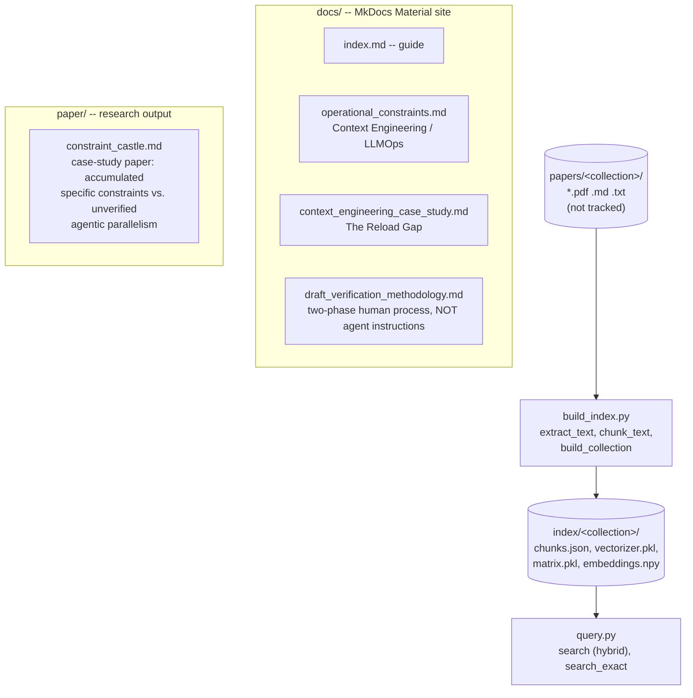

# local-quantum-rag — Architecture

Generated by scanning the real file tree, not from memory. This repo is deliberately small:
two standalone scripts (`build_index.py`, `query.py`), no internal package, no subpackages.
Renamed from `quantum-rag` to `local-quantum-rag` (2026-09-24) to avoid a name collision with
an unrelated paper of the same name already archived on Zenodo.

## How to read this

There is no `import`-time dependency graph here — `build_index.py` and `query.py` are each a
single standalone script (`[tool.setuptools] py-modules`), run directly or via the installed
console scripts `local-quantum-rag-build` / `local-quantum-rag-query`. Both read/write the same
on-disk `index/<collection>/` artifacts (`chunks.json`, `vectorizer.pkl`, `matrix.pkl`,
`embeddings.npy`) — that directory is the only real "interface" between them.

### Notable facts (verified, not assumed)

- **`search_exact`** (in `query.py`) was independently re-derived and promoted into a sibling
  library's own RAG utility (`ia_utils.rag.search_exact` in Dense-Evolution) after a direct
  comparison showed the two tools were meant to behave identically but the ported version was
  missing it — literal case-insensitive substring by default, real case-sensitive regex with
  `--regex`, at most one match reported per chunk (not exhaustive).
- **`docs/draft_verification_methodology.md` is explicitly NOT an agent instruction** — its own
  header states an AI reading it as a rule would try to execute "phase 1 then phase 2" on
  itself, which is incoherent, since the two phases are carried out by two *different* AIs.
  It is kept structurally separate from `docs/operational_constraints.md`, which *is* addressed
  to an agent — reading both as one instruction set would give an AI contradictory guidance.
- **`paper/constraint_castle.md`** treats this repo's own `docs/context_engineering_case_study.md`
  ("The Reload Gap") as Case Study 4.1 of its argument — the repo's documentation and its
  research output are not independent; the paper cites the docs directly.
- **Codecov requires a token** (`CODECOV_TOKEN` secret) for this repo since Codecov deprecated
  tokenless uploads for public repos — `.github/workflows/ci.yml`'s upload step passes
  `token: ${{ secrets.CODECOV_TOKEN }}`; the secret itself must be set from the repo's
  codecov.io dashboard (an account-level action, not one a CI edit alone can fix).
- **GitHub Pages** (`https://tatopenn-cell.github.io/local-quantum-rag/`) is built by
  `.github/workflows/docs.yml` via `mkdocs build --strict` + `actions/deploy-pages` — the same
  MkDocs Material theme/palette as Dense-Evolution's own docs site, deliberately matched.
- **The Zenodo DOI** (10.5281/zenodo.22914813, archived v0.1.0) predates the rename and is
  minted under the old title `quantum-rag` — an immutable historical record, not updated
  retroactively; `CITATION.cff`'s title is updated to `local-quantum-rag` for any future release.
